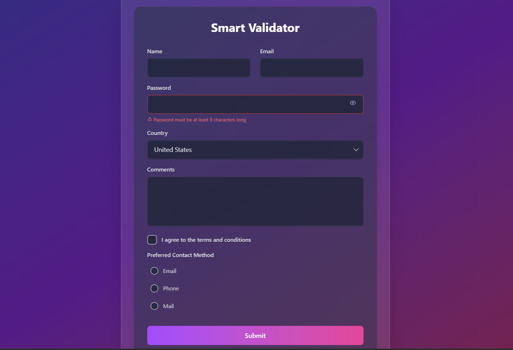

# Smart Validator



A customizable and reusable smart validator built with React, TypeScript, and Tailwind CSS. This widget includes advanced validation, error handling, micro-animations, and customizable styles, all in a production-ready npm package.

# Smart Validator

Smart Validator is a reusable and customizable Form Validator Widget built with React and TypeScript. This widget provides comprehensive form validation, error handling, micro-animations, and customizable styles using Tailwind CSS. It is designed to be easy to import into other React applications.

## Table of Contents

- [Smart Validator](#smart-validator)
- [Smart Validator](#smart-validator-1)
  - [Table of Contents](#table-of-contents)
  - [Features](#features)
  - [Components](#components)
    - [Input](#input)
    - [Email](#email)
    - [Password](#password)
    - [Select](#select)
    - [TextArea](#textarea)
    - [Checkbox](#checkbox)
    - [Radio](#radio)
    - [Range](#range)
    - [Button](#button)
    - [Form](#form)
  - [Installation](#installation)
  - [Usage](#usage)
  - [Example](#example)
  - [Customization](#customization)
    - [Example of Custom Styles](#example-of-custom-styles)
  - [Contributing](#contributing)

## Features

- **Comprehensive Form Validation**: Each input component performs its own validation, providing real-time feedback to users.
- **Error Handling**: Displays meaningful error messages based on user input, ensuring a smooth user experience.
- **Micro-Animations**: Subtle animations enhance the user experience during interactions.
- **Customizable Styles**: Built with Tailwind CSS, allowing easy customization to fit your application's theme.
- **Dark Theme Support**: All components are styled with dark-themed colors, providing a modern look and feel.
- **Debouncing and Throttling**: Implements debouncing for input validation to improve performance and user experience.
- **Reusable Components**: Each form component is designed to be reusable across different forms, promoting code reusability and maintainability.

## Components

### Input

- A basic text input component with customizable validation.
- Supports real-time error display.

### Email

- Extends the Input component with email-specific validation.
- Validates email format in real-time, ensuring:
  - Contains `@` symbol.
  - Has a username before `@`.
  - Has a domain after `@`.
  - Domain contains a `.` (dot).
  - Domain extension is at least 2 characters long.

### Password

- A password input component with visibility toggle.
- Validates password strength based on custom rules, such as length and character variety.

### Select

- A dropdown select component for choosing options.
- Supports error handling and customizable options.

### TextArea

- A multi-line text input component for longer text inputs.
- Supports validation and error handling.

### Checkbox

- A checkbox component for boolean inputs.
- Displays error messages if required.

### Radio

- A radio button group for selecting one option from multiple choices.
- Supports error handling and customizable options.

### Range

- A range input component for selecting numeric values.
- Displays the current value and supports error handling.

### Button

- A customizable button component with different styles (primary, secondary, danger).
- Supports loading states and click events.

### Form

- A wrapper component that handles form submission and validation.
- Displays error messages for invalid inputs and manages form state.

## Installation

To install the Smart Validator package, use npm or yarn:

```bash
npm install smart-validator-ts
```

or

```bash
yarn add smart-validator-ts
```

## Usage

To use the Smart Validator in your React application, follow these steps:

1. Import the desired components into your form.
2. Use the components to create your form and handle validation as needed.

## Example

Here’s a simple example of how to use the Smart Validator components in a form:

```tsx
import React, { useState, useRef } from "react";
import { 
  Form, 
  Input, 
  Email, 
  Password, 
  Select, 
  TextArea, 
  Checkbox, 
  Radio, 
  Range, 
  Button 
} from "smart-validator-ts";


const App: React.FC = () => {
  const [showPopup, setShowPopup] = useState(false);
  const formRef = useRef<HTMLFormElement>(null);

  const handleSubmit = (event: React.FormEvent<HTMLFormElement>) => {
    event.preventDefault();
    const formData = new FormData(event.currentTarget);
    console.log(Object.fromEntries(formData));
    setShowPopup(true);
    
    if (formRef.current) {
      formRef.current.reset();
    }

    setTimeout(() => {
      setShowPopup(false);
    }, 3000);
  };

  return (
    <div className="min-h-screen bg-gradient-to-br from-indigo-900 via-purple-900 to-pink-900 flex justify-center items-center p-8 relative">
      <div className="absolute inset-0 bg-[url('data:image/svg+xml;base64,PHN2ZyB3aWR0aD0iNTAwIiBoZWlnaHQ9IjUwMCIgeG1sbnM9Imh0dHA6Ly93d3cudzMub3JnLzIwMDAvc3ZnIj48ZGVmcz48cGF0dGVybiBpZD0iZ3JpZCIgd2lkdGg9IjUwIiBoZWlnaHQ9IjUwIiBwYXR0ZXJuVW5pdHM9InVzZXJTcGFjZU9uVXNlIj48cGF0aCBkPSJNIDUwIDAgTCAwIDAgMCA1MCIgZmlsbD0ibm9uZSIgc3Ryb2tlPSJyZ2JhKDI1NSwgMjU1LCAyNTUsIDAuMDUpIiBzdHJva2Utd2lkdGg9IjEiLz48L3BhdHRlcm4+PC9kZWZzPjxyZWN0IHdpZHRoPSIxMDAlIiBoZWlnaHQ9IjEwMCUiIGZpbGw9InVybCgjZ3JpZCkiLz48L3N2Zz4=')] opacity-20"></div>
      
      <div className="w-full max-w-2xl backdrop-blur-lg bg-white/10 rounded-2xl shadow-2xl p-8 border border-white/20">
        <Form onSubmit={handleSubmit} ref={formRef} className="space-y-6">
          <h2 className="text-3xl font-bold mb-8 text-white text-center bg-clip-text bg-gradient-to-r from-purple-400 to-pink-400">
            Smart Validator
          </h2>
          
          <div className="grid gap-6 md:grid-cols-2">
            <Input label="Name" name="name" id="name" required />
            <Email label="Email" name="email" id="email" required />
          </div>
          
          <Password label="Password" name="password" id="password" required />
          
          <Select
            label="Country"
            name="country"
            id="country"
            options={[
              { value: "us", label: "United States" },
              { value: "ca", label: "Canada" },
              { value: "uk", label: "United Kingdom" },
            ]}
          />
          
          <TextArea label="Comments" name="comments" id="comments" rows={4} />
          
          <div className="space-y-4">
            <Checkbox label="I agree to the terms and conditions" name="agree" id="agree" required />
            
            <Radio
              label="Preferred Contact Method"
              name="contactMethod"
              options={[
                { value: "email", label: "Email" },
                { value: "phone", label: "Phone" },
                { value: "mail", label: "Mail" },
              ]}
            />
            
            
            <Range label="Age" name="age" id="age" min={18} max={100} defaultValue={30} />
          </div>
          
          <div className="pt-4">
            <Button type="submit" className="w-full bg-gradient-to-r from-purple-500 to-pink-500 hover:from-purple-600 hover:to-pink-600 text-white font-semibold py-3 px-6 rounded-lg transform transition-all duration-200 hover:scale-[1.02] active:scale-[0.98] focus:outline-none focus:ring-2 focus:ring-purple-500 focus:ring-offset-2 focus:ring-offset-purple-900">
              Submit
            </Button>
          </div>
        </Form>
      </div>

      {showPopup && (
        <div className="fixed inset-0 flex items-center justify-center z-50">
          <div className="animate-in slide-in-from-top-4 duration-300">
            <div className="backdrop-blur-xl bg-gradient-to-r from-green-500/90 to-emerald-500/90 text-white px-8 py-6 rounded-xl shadow-2xl border border-white/20 transform transition-all">
              <p className="text-lg font-semibold">Form Submitted Successfully!</p>
            </div>
          </div>
        </div>
      )}
    </div>
  );
};

export default App;
```

## Customization

You can easily customize the styles of the components using Tailwind CSS classes. Each component accepts standard HTML attributes, allowing you to apply additional styles as needed.

### Example of Custom Styles

```tsx
<Button type="submit" className="bg-blue-600 hover:bg-blue-700 text-white">
  Submit
</Button>
```

## Contributing

Contributions are welcome! If you would like to contribute to the Smart Validator, please follow these steps:

1. Fork the repository.
2. Create a new branch (`git checkout -b feature-branch`).
3. Make your changes and commit them (`git commit -m 'Add new feature'`).
4. Push to the branch (`git push origin feature-branch`).
5. Create a new Pull Request.


